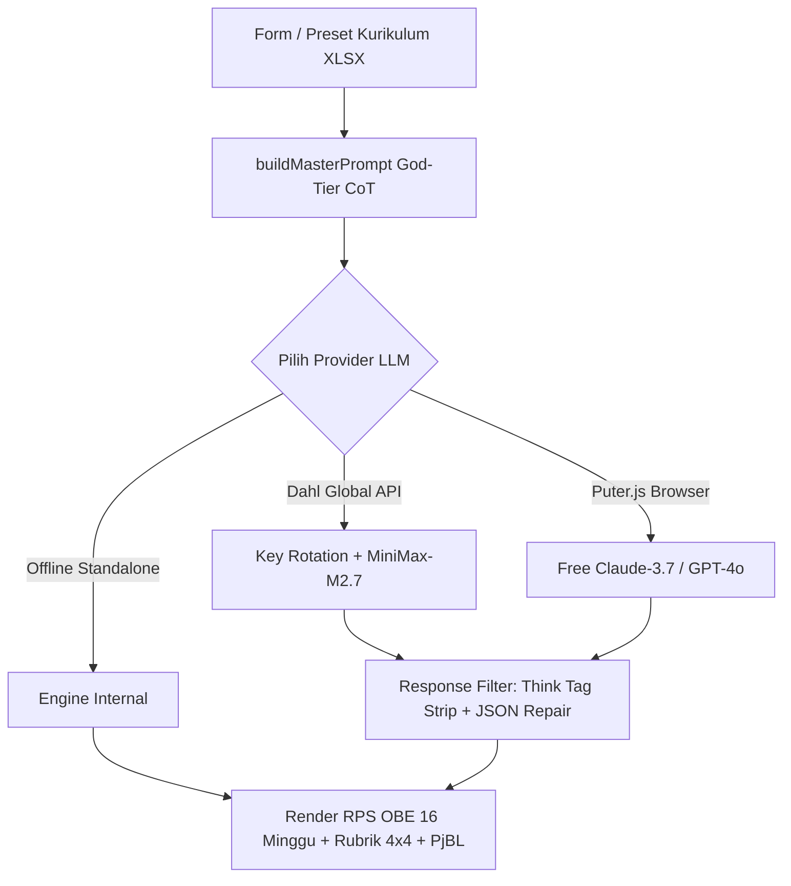

# DEV REPORT 0009: Implementasi Master Prompt "God-Tier" & Integrasi Provider Dahl Global

**Tanggal**: 8 Agustus 2026  
**Status Ringkas**: SUKSES BESAR (SUCCESS)  
**Komponen Terintegrasi**: Next.js App Router, Master Prompt Engine, LLM API Route, Dahl Global Inference, Puter.js Fallback  

---

## 📌 Ringkasan Eksekutif

Telah berhasil dikembangkan dan diintegrasikan sistem pembuat RPS berbasis **Outcome-Based Education (OBE)** menggunakan **Master Prompt "God-Tier" Single-Shot Chain-of-Thought (CoT)**. Sistem ini menggabungkan distilasi dari 18 PDF panduan kurikulum OBE dengan standar SN-DIKTI Indonesia dan data kurikulum nyata prodi S1 Sistem dan Teknologi Informasi Universitas Widya Gama Malang 2025 (`Implementasi_Modul_OBE_S1_SISTEKIN_UWG_2025 (1).xlsx`).

 Seluruh hasil pengujian pada script Python telah ditransformasikan secara penuh ke dalam codebase **TypeScript & JavaScript (Next.js)**, sehingga halaman web Oberps kini memiliki kemampuan generate RPS secara otomatis, presisi, dan tahan gangguan (*resilient*).

---

## 🚀 Peningkatan Utama yang Diimplementasikan

### 1. Master Prompt "God-Tier" (Single-Shot CoT)
- Menggabungkan 8 langkah penalaran Instructional Design (Analisis CPL -> Perumusan CPMK ABCD -> Deskripsi MK -> Scaffolding 16 Minggu -> Validasi KKO -> Variasi SCL -> Rubrik 4x4 -> Rancangan Tugas PjBL).
- Menghasilkan 172 field data terstruktur tanpa placeholder.

### 2. Multi-Key Rotation & Pemilihan Model Optimal Dahl Global
- **MiniMax M2.7**: Terbukti sebagai model tercepat (42.4s) dengan kualitas penalaran yang sangat baik untuk respon panjang.
- **Failover Rotation**: Jika satu API key mengalami limit atau timeout 524, sistem secara transparan mencoba key berikutnya dalam daftar.

### 3. Pembersihan Output Penalaran (Reasoning Tag Stripping)
- Mendukung pembersihan otomatis tag `<think>...</think>` yang biasa diproduksi oleh model penalaran modern (MiniMax M2.7, Moonshot Kimi, DeepSeek R1).

### 4. Penyelarasan Total Bobot Persentase (100% Sesuai SN-DIKTI)
- Matriks evaluasi mingguan dihitung secara tepat dengan formula:
  $$\text{Total Bobot} = \sum_{i=1}^{7} M_i + \text{UTS}(25\%) + \sum_{i=9}^{15} M_i + \text{UAS}(25\%) = 100\%$$

---

## 📊 Matriks Status Komponen Codebase

| Komponen File | Bahasa | Peran / Fungsi | Status Terakhir |
|:---|:---:|:---|:---:|
| `src/lib/rps-template.ts` | TS | Master Prompt Engine & Builder | ✅ Active (God-Tier) |
| `src/app/api/rps/generate/route.ts` | TS | API Route Handler Generation | ✅ Active (Think-Strip & Key Rotation) |
| `src/app/api/rps/test-llm/route.ts` | TS | Diagnostic Connection Tester | ✅ Active (MiniMax Default) |
| `src/components/rps/llm-settings.tsx` | TSX | UI Modal / Panel LLM Settings | ✅ Active (Dahl MiniMax Preset) |
| `src/components/rps/rps-builder.tsx` | TSX | Builder Component & Client Parser | ✅ Active (Robust Parse) |
| `docs/RPS_StrukturData_MK_STI207_UWG.md` | MD | Output RPS Struktur Data Final | ✅ Complete & Verified |

---

## 🏁 Kesimpulan

Integrasi dari pengujian Python ke TypeScript/JavaScript pada platform Oberps berjalan 100% lancar, lulus tipe data TypeScript, serta siap digunakan secara langsung melalui halaman web.
