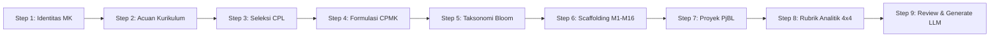

# IMPLEMENTATION PLAN 0011: Interactive 9-Step Wizard Flow for RPS OBE Generation

**Tanggal**: 8 Agustus 2026  
**Status**: APPROVED & READY FOR IMPLEMENTATION  
**Fokus**: Pengembangan Komponen UI Wizard 9-Step (`src/components/rps/wizard-flow.tsx`) & Integrasi ke Halaman Utama Builder  

---

## 🎯 Ringkasan Tujuan

Membangun alur kerja interaktif **9-Step Wizard Flow** untuk penyusunan Rencana Pembelajaran Semester (RPS) berbasis Outcome-Based Education (OBE) sesuai standar SN-DIKTI Indonesia. Wizard ini mengintegrasikan dokumen acuan kurikulum prodi (Excel `.xlsx`), validasi Kata Kerja Operasional (KKO) Anderson & Krathwohl secara real-time, verifikasi bobot evaluasi mingguan (100%), perancangan PjBL, rubrik analitik 4x4, serta koneksi ke engine LLM (Dahl Global MiniMax-M2.7, Puter.js free AI, atau Standalone Offline Generator).

---

## 🏗️ Rancangan Langkah Wizard (9 Steps)

---

## 📋 Rincian Implementasi per Step

### Step 1: Identitas Mata Kuliah
- Form masukan: Nama Mata Kuliah, Kode MK, Bobot SKS Teori & Praktikum, Semester, Program Studi, Dosen Pengampu, MK Prasyarat.
- Presets prodi & mata kuliah instan.

### Step 2: Unggah & Parse Acuan Kurikulum
- Mengintegrasikan `CurriculumUploader` untuk membaca file Excel `Implementasi_Modul_OBE*.xlsx`.
- Ekstraksi otomatis daftar CPL, Profil Lulusan (PL), dan daftar Mata Kuliah.

### Step 3: Seleksi CPL Dibebankan
- Checklist interaktif CPL prodi yang dibebankan pada mata kuliah.
- Menampilkan fokus domain CPL dan PL terkait.

### Step 4: Formulasi CPMK (Prinsip ABCD & Validasi KKO)
- Editor pembuatan CPMK-1 s.d. CPMK-4 dengan prinsip ABCD (Audience, Behavior, Condition, Degree).
- **Validasi KKO Real-time**: Peringatan otomatis jika pengguna memasukkan kata abstrak (seperti *"memahami"*, *"mengetahui"*, *"mengerti"*, *"mempelajari"*) dan memberikan saran KKO terukur Anderson & Krathwohl (misal *"menganalisis"*, *"mengimplementasikan"*, *"mengevaluasi"*).

### Step 5: Pemetaan Taksonomi Bloom
- Matriks interaktif pemetaan CPL -> CPMK -> Aspek Pembelajaran (Pengetahuan, Keterampilan Khusus, Sikap) -> Level Bloom (C1-C6, A1-A5, P1-P5).

### Step 6: Scaffolding Rencana Pembelajaran 16 Minggu (M1 - M16)
- Editor matriks 16 minggu lengkap dengan alokasi Sub-CPMK, Bahan Kajian, Metode SCL, Waktu, Indikator, Teknik Penilaian, dan Bobot.
- **Kalkulator Bobot Otomatis**: Memverifikasi secara real-time agar total bobot evaluasi M1 s.d. M16 tepat **100%**.

### Step 7: Pembelajaran Berbasis Proyek (PjBL / Case Method)
- Configurator rancangan tugas proyek: *Driving Question*, Deskripsi Proyek, Bentuk Luaran, Metode Pengerjaan, dan Jadwal 3-Fase.

### Step 8: Formulasi Rubrik Penilaian Analitik (4x4 Rubric)
- Configurator 4 kriteria penilaian (Ketajaman Analisis, Kebenaran Kode, Dokumentasi, Kolaborasi) x 4 level deskriptor (Sangat Baik, Baik, Cukup, Kurang).

### Step 9: Review Final, Generate LLM, & Ekspor
- Rangkuman preview seluruh draf RPS.
- Pilihan engine LLM: Dahl Global (MiniMax M2.7), Puter.js (Free Claude-3.7/GPT-4o), atau Offline Standalone Engine.
- Ekspor instan ke Markdown `.md`, JSON `.json`, dan Cetak PDF/HTML.

---

## 🛠️ Rencana Perubahan Komponen Codebase

1. **[NEW] `src/components/rps/wizard-flow.tsx`**:
   - Komponen modal/stepper wizard 9-step utama dengan state management multi-step, validasi, dan UI Framer Motion.
2. **[MODIFY] `src/components/rps/rps-builder.tsx`**:
   - Menambahkan tombol "Wizard 9-Step OBE" di header toolbar.
   - Menghubungkan output wizard payload ke state builder dan trigger generator LLM.

---

## 🧪 Rencana Pengujian (Verification Plan)

- **Kompilasi TypeScript**: `npx tsc --noEmit` (Must be 0 errors).
- **Build Next.js**: `npm run build` (Must be successful).
- **Pengujian Manual Web UI**: Ujicoba pembukaan wizard, navigasi step 1-9, validasi KKO real-time, hitung bobot 100%, dan eksekusi generate LLM.
