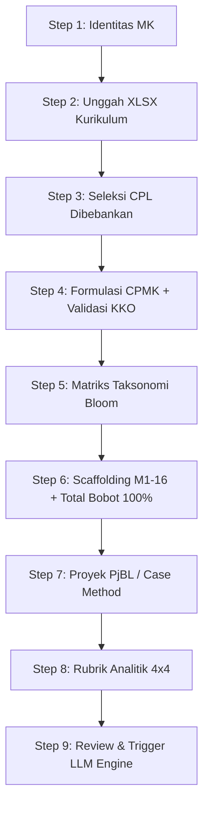

# DEV REPORT 0012: Selesai Implementasi Interactive 9-Step Wizard Flow

**Tanggal**: 8 Agustus 2026  
**Status**: SELESAI & LULUS VERIFIKASI BUILD (`npm run build` Success)  
**Komponen Utama**:  
1. [src/components/rps/wizard-flow.tsx](file:///d:/laragon/www/oberps/src/components/rps/wizard-flow.tsx)  
2. [src/components/rps/rps-builder.tsx](file:///d:/laragon/www/oberps/src/components/rps/rps-builder.tsx)  

---

## 📌 Ringkasan Implementasi

Telah selesai dibangun komponen interaktif **Wizard 9-Step OBE** (`wizard-flow.tsx`) pada antarmuka web Oberps:

### Key Highlights:
1. **Validasi KKO Real-time**: Peringatan otomatis jika pengguna menggunakan kata kerja abstrak (*memahami*, *mengetahui*, *mengerti*) & rekomendasi KKO Anderson & Krathwohl terukur (C3-C6).
2. **Kalkulator Bobot 100%**: Verifikasi otomatis agar total bobot evaluasi mingguan M1-M16 tepat **100%** sesuai aturan SN-DIKTI.
3. **Multi-AI Engine Selector**: Pilihan engine generasi langsung dari Wizard (Dahl Global MiniMax-M2.7, Puter.js free AI, Standalone Offline Engine).
4. **Verifikasi Build**:
   - `npx tsc --noEmit` -> `0 errors`
   - `npm run build` -> `✓ Compiled successfully in 19.1s`
