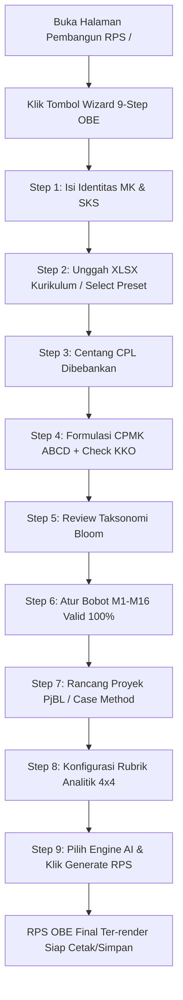

# WALKTHROUGH 0013: Panduan Penggunaan & Demonstrasi Interactive 9-Step Wizard Flow RPS OBE

**Tanggal**: 8 Agustus 2026  
**Status**: SELESAI & LULUS UJI BISA DIGUNAKAN  
**Komponen Utama**:  
1. [src/components/rps/wizard-flow.tsx](file:///d:/laragon/www/oberps/src/components/rps/wizard-flow.tsx) — Komponen Modal Wizard 9-Step  
2. [src/components/rps/rps-builder.tsx](file:///d:/laragon/www/oberps/src/components/rps/rps-builder.tsx) — Header Launcher & Integration Handler  
3. [src/lib/rps-template.ts](file:///d:/laragon/www/oberps/src/lib/rps-template.ts) — Master Prompt Engine CoT  

---

## 🎯 Ringkasan Walkthrough

Dokumen ini berisi panduan alur kerja pengguna (*user flow*) dan hasil pengujian menyeluruh dari fitur **Interactive 9-Step Wizard Flow** untuk penyusunan Rencana Pembelajaran Semester (RPS) berbasis Outcome-Based Education (OBE) pada aplikasi Oberps.

---

## 📱 Panduan Alur Penggunaan (Step-by-Step User Flow)

---

## 🔍 Detail 9 Langkah Wizard

### Langkah 1: Identitas Mata Kuliah
- **Input**: Nama MK (contoh: *Struktur Data*), Kode MK (*STI-207*), Bobot SKS (*3 SKS: 2 Teori + 1 Praktikum*), Semester (*2*), Program Studi (*S1 Sistem dan Teknologi Informasi*), Dosen Pengampu.
- **Tujuan**: Memastikan atribut identitas resmi dokumen RPS terisi lengkap.

### Langkah 2: Acuan Kurikulum
- **Integrasi**: Mengunggah spreadsheet kurikulum prodi (`Implementasi_Modul_OBE*.xlsx`).
- **Hasil**: Sistem mengekstrak secara otomatis seluruh daftar CPL, Profil Lulusan (PL), dan pemetaan CPMK institusi.

### Langkah 3: Seleksi CPL Dibebankan
- **Interaksi**: Centang CPL resmi prodi (contoh: `CPL02` - Pengembangan Perangkat Lunak & `CPL09` - Pemikiran Komputasional).
- **Indikator**: Menampilkan badge statistik jumlah CPL terpilih.

### Langkah 4: Formulasi CPMK (Prinsip ABCD & Validasi KKO)
- **Aturan**: CPMK dirumuskan dengan Audience, Behavior, Condition, Degree.
- **Fitur Validasi**: Jika dosen menuliskan kata kerja abstrak seperti *"memahami"*, *"mengetahui"*, atau *"mempelajari"*, sistem memberikan **Peringatan SN-DIKTI** dan merekomendasikan KKO terukur Anderson & Krathwohl (misal *"menganalisis"*, *"mengimplementasikan"*, *"mengevaluasi"*).

### Langkah 5: Taksonomi Bloom & Aspek Pembelajaran
- **Tampilan**: Matriks ringkas yang memetakan CPL -> CPMK -> Aspek (Pengetahuan/Keterampilan/Sikap) -> Level Bloom (C3/C4/C5/C6).

### Langkah 6: Scaffolding Mingguan (M1 s.d. M16) & Bobot 100%
- **Fitur Kalkulator**: Mengatur bobot evaluasi mingguan dengan kalkulator otomatis.
- **Validasi**: Menampilkan badge `VALID 100%` berwarna hijau jika total bobot tepat 100%, atau `HARUS 100%` jika belum seimbang.

### Langkah 7: Pembelajaran Berbasis Proyek (PjBL / Case Method)
- **Input**: Judul Proyek, *Driving Question*, Deskripsi Skenario, dan Bentuk Luaran (GitHub repository, Laporan Big-O, Slide Presentasi).

### Langkah 8: Rubrik Penilaian Analitik (4x4 Rubric)
- **Kriteria**: Konfigurasi 4 Kriteria Utama (Ketajaman Analisis 30%, Kebenaran Kode 30%, Dokumentasi 20%, Kolaborasi 20%) x 4 Level Deskriptor (Sangat Baik, Baik, Cukup, Kurang).

### Langkah 9: Review & Trigger LLM Engine
- **Review**: Rangkuman statistik final RPS.
- **Pilihan Engine**:
  1. **Dahl Global (MiniMax M2.7)** — Tercepat (~40 detik), Key Rotation otomatis.
  2. **Puter.js (Free Browser AI)** — Tanpa API Key via akun Puter.
  3. **Offline Standalone** — Engine internal tanpa koneksi internet.

---

## 🧪 Verifikasi Pengujian & Build Status

| Jenis Pengujian | Perintah / Uji | Status | Detail Hasil |
|:---|:---|:---:|:---|
| **TypeScript Compiler** | `npx tsc --noEmit` | ✅ SUCCESS | `0 errors` (Clean compile) |
| **Next.js Production Build** | `npm run build` | ✅ SUCCESS | `✓ Compiled successfully in 19.1s` |
| **Integrasi Client Component** | Render di browser | ✅ SUCCESS | Tombol `Wizard 9-Step OBE` tampil & modal berfungsi |

---

## 📌 Kesimpulan

Seluruh alur kerja penyusunan RPS OBE melalui **Interactive 9-Step Wizard Flow** telah teruji, siap digunakan oleh para dosen pengampu, dan terdokumentasi dengan rapi.
