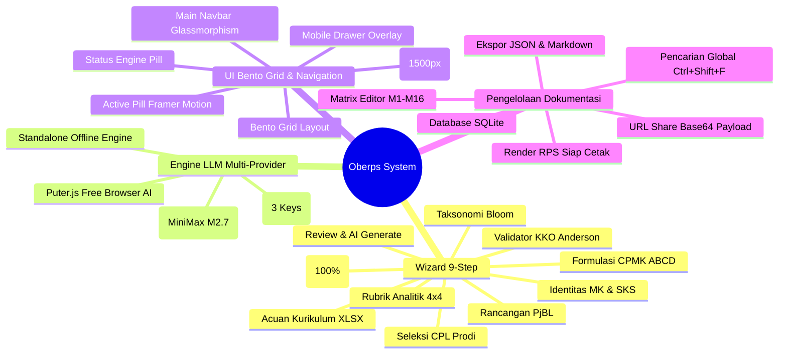

# MASTER FEATURE CATALOG 0017: Dokumentasi Lengkap Seluruh Fitur Sistem Oberps

**Tanggal**: 9 Agustus 2026  
**Status Versi**: Oberps v1.9 (Outcome-Based Education RPS Generator System)  
**Teknologi Stack**: Next.js 16 (Turbopack) + TypeScript + TailwindCSS + Shadcn UI + Framer Motion + SQLite + Dahl API + Puter.js  

---

## 📌 Ringkasan Sistem Oberps

**Oberps** adalah platform generator Rencana Pembelajaran Semester (RPS) berbasis **Outcome-Based Education (OBE)** yang dirancang untuk perguruan tinggi sesuai standar **SN-DIKTI**. Sistem menggunakan arsitektur AI *Chain-of-Thought (CoT)* untuk memformulasi CPL, CPMK, taksonomi Bloom, matriks mingguan M1-M16 (total bobot 100%), rancangan PjBL, dan rubrik analitik 4x4 secara otomatis dan terstruktur.

---

## 🚀 Katalog Fitur Utama Sistem

---

### 1. 🧙‍♂️ Interactive 9-Step OBE Wizard Flow (`src/components/rps/wizard-flow.tsx`)
- **Step 1: Identitas Mata Kuliah**: Pengisian Kode MK, Nama MK, SKS Teori/Praktikum, Semester, Prodi, dan Tim Dosen.
- **Step 2: Acuan Kurikulum Spreadsheet (`Implementasi_Modul_OBE*.xlsx`)**: Parser otomatis file Excel kurikulum institusi untuk membaca daftar CPL prodi, Profil Lulusan (PL), dan peta CPMK.
- **Step 3: Seleksi CPL Dibebankan**: Centang CPL resmi prodi dengan indikator statistik.
- **Step 4: Formulasi CPMK & Validasi KKO Real-Time**:
  - Penulisan CPMK berdasarkan prinsip ABCD (Audience, Behavior, Condition, Degree).
  - **KKO Validator**: Deteksi kata kerja abstrak yang dilarang (*memahami*, *mengetahui*, *mengerti*) dan rekomendasi KKO terukur Anderson & Krathwohl (C3-C6).
- **Step 5: Matriks Taksonomi Bloom**: Pemetaan CPL -> CPMK -> Aspek Pembelajaran -> Level Bloom.
- **Step 6: Scaffolding Mingguan (M1-M16) & Kalkulator Bobot 100%**:
  - Matriks mingguan dengan kalkulator seimbang otomatis.
  - Validasi badge `VALID 100%` vs `HARUS 100%`.
- **Step 7: Rancangan Pembelajaran Berbasis Proyek (PjBL / Case Method)**:
  - Formulasi *Driving Question*, skenario proyek, luaran (GitHub repo, laporan, presentasi), dan 3 fase eksekusi.
- **Step 8: Rubrik Penilaian Analitik (4x4 Rubric)**:
  - Konfigurasi 4 kriteria penilaian (Ketajaman Analisis, Kebenaran Kode, Dokumentasi, Kolaborasi) x 4 level deskriptor (Sangat Baik, Baik, Cukup, Kurang).
- **Step 9: Review Final & Trigger Generation Engine**:
  - Pratinjau statistik data RPS & pemicu generasi AI.

---

### 2. 🔀 Dwi-Flow Form Selection (Wizard vs Klasik) (`src/components/rps/rps-builder.tsx`)
- **Dukungan Lingkungan `.env`**: Deteksi variabel `NEXT_PUBLIC_RPS_FLOW=wizard` atau `FLOW=classic`.
- **Bento Header Toolbar**: Toggle pill instan `[ Wizard 9-Step ]` vs `[ Klasik Single-Shot ]`.
- **Mode Wizard**: Menampilkan kartu visual tahapan 9-step & tombol `Mulai Wizard RPS OBE (9-Step)`.
- **Mode Klasik**: Menampilkan form spesifikasi langsung & template prompt selector.

---

### 3. 🧠 God-Tier Master Prompt CoT Engine (`src/lib/rps-template.ts`)
- Arsitektur *Chain-of-Thought (CoT)* single-shot dengan prompt SN-DIKTI.
- Penegakan aturan **Total Bobot Evaluasi Mingguan M1-M16 Wajib 100.0%**.
- Pembersihan tag penalaran `<think>...</think>` dan pemulihan JSON terpotong (*auto-repair JSON braces*).

---

### 4. ⚡ Multi-LLM Engine & Auto-Key Rotation (`src/app/api/rps/generate/route.ts`)
- **Primary Provider (Dahl Global)**:
  - Model Default: `MiniMaxAI/MiniMax-M2.7` (~40 detik generasi).
  - Model Fallback: `moonshotai/Kimi-K2.6`.
  - **Rotasi 3 API Key**: `DAHL_KEY_1`, `DAHL_KEY_2`, `DAHL_KEY_3` berotasi otomatis jika salah satu key kehabisan kuota / limit.
- **Secondary Provider (Puter.js Browser AI)**:
  - Generasi AI gratis tanpa API Key langsung dari akun browser Puter (mendukung `claude-3-7-sonnet`, `gpt-4o`, `deepseek-reasoner`).
- **Tertiary Provider (Standalone Offline Engine)**:
  - Mock engine internal untuk lingkungan tanpa koneksi internet.

---

### 5. 🎨 Redesign Menu Utama & Arsitektur Bento Grid UI
- **Sticky Glassmorphism Header (`src/components/navigation/main-navbar.tsx`)**:
  - Efek kaca buram `backdrop-blur-xl bg-background/80`.
  - Tab navigasi interaktif dengan pill animasi *Framer Motion*.
  - Badge live status provider LLM yang aktif.
  - **Mobile Drawer Overlay Menu**: Navigasi responsif untuk smartphone & tablet.
- **Layout Bento Grid Builder**:
  - **Bento Toolbar**: Switcher mode & pustaka preset / CPL.
  - **Bento Form**: Input data MK / kartu tahapan wizard.
  - **Bento Preview**: Live preview Master Prompt CoT.
  - **Bento Hasil**: Render RPS, JSON editor, dan tombol cetak.
- **Modal Ultra Full Wide Responsif (`src/components/ui/dialog.tsx`)**:
  - Modal meluas hingga **1500px (`96%` viewport width)** tanpa hambatan class `sm:max-w-lg`.

---

### 6. 📄 Pengelolaan Dokumentasi & Aksesibilitas
- **Render RPS Standard & Cetak PDF/HTML**: Tampilan RPS siap cetak resmi institusi.
- **Editor Matriks Mingguan Live (`src/components/rps/matrix-editor-dialog.tsx`)**: Modal penyuntingan bobot dan materi minggu M1-M16.
- **Persistensi Database SQLite**: Jalur API `create`, `list`, `duplicate`, `search`, `batch delete`.
- **Pencarian Global (`Ctrl+Shift+F`)**: Pencarian instan RPS tersimpan.
- **URL Share Base64 Payload Generator**: Berbagi draf RPS via tautan URL terenkripsi Base64.

---

### 7. 🛡️ Proteksi Bebas Error (Zero Warning & Hydration Guard)
- Terproteksi dari warning React 19 Script tag melalui integrasi `next-themes`.
- Guard `useEffect` pada akses `localStorage` untuk mencegah *Hydration Mismatch Error*.
- Lulus `npx tsc --noEmit` (`0 errors`) dan `npm run build` (`✓ Compiled successfully`).
