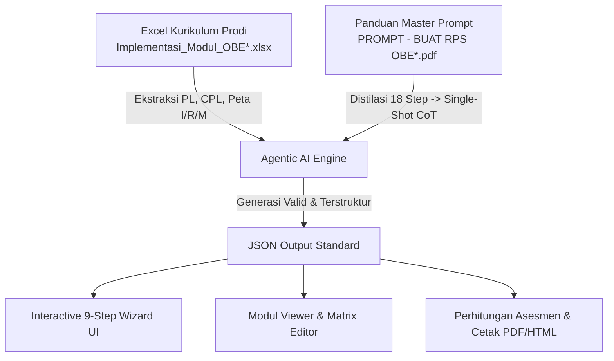
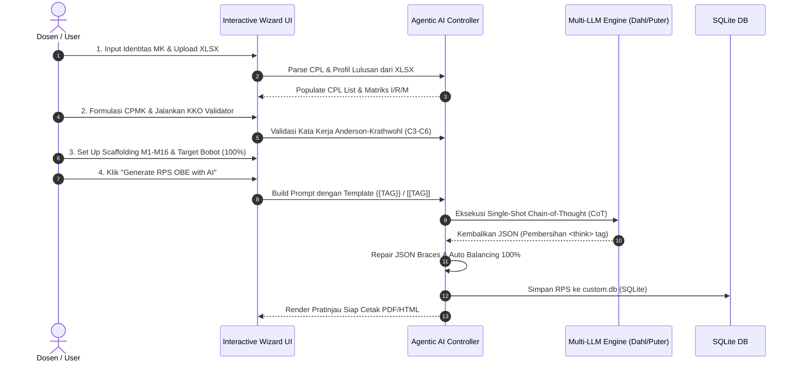
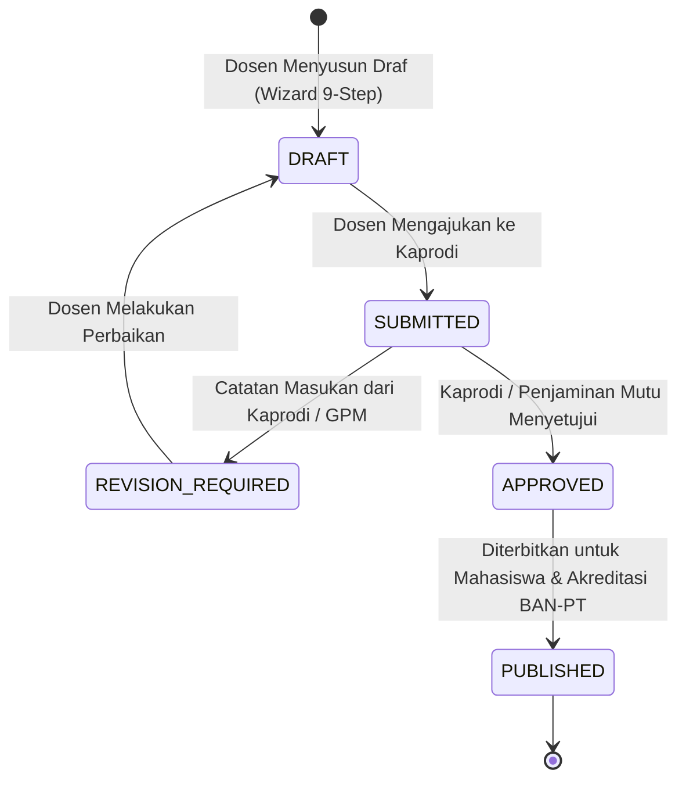

# 📘 PRODUCT REQUIREMENT DOCUMENT (PRD) FOR AGENTIC AI
## Sistem Pembangkit Rencana Pembelajaran Semester (RPS) Berbasis Outcome-Based Education (OBE) & SN-DIKTI

**Dokumen ID**: PRD-OBE-RPS-2026-01  
**Versi**: 3.2.0 (Enterprise Platinum Final)  
**Tanggal**: 9 Agustus 2026  
**Status**: DIREKOMENDASIKAN UNTUK AUTONOMOUS AGENTIC AI EXECUTION  
**Target Pengguna AI**: Autonomous Software Engineers (Antigravity, Codex, Kiro, Agentic Subagents, AutoGen, LangGraph)  

---

## 📑 Daftar Isi
1. [Visi Produk & Tujuan Utama](#1-visi-produk--tujuan-utama)
2. [Arsitektur & Spesifikasi Sumber Data Master](#2-arsitektur--spesifikasi-sumber-data-master)
3. [Alur Kerja Sistem & Agentic AI Orchestration](#3-alur-kerja-sistem--agentic-ai-orchestration)
4. [Persyaratan Fungsional (Functional Requirements)](#4-persyaratan-fungsional-functional-requirements)
5. [Persyaratan Non-Fungsional & Keamanan](#5-persyaratan-non-fungsional--keamanan)
6. [Skema Data Master & Aturan Validasi](#6-skema-data-master--aturan-validasi)
7. [Spesifikasi Master Prompt CoT (God-Tier Template)](#7-spesifikasi-master-prompt-cot-god-tier-template)
8. [Matriks Pengujian & Verifikasi Kualitas](#8-matriks-pengujian--verifikasi-kualitas)
9. [JSON Auto-Repair & Schema Healing Engine](#9-json-auto-repair--schema-healing-engine)
10. [Multi-LLM Provider Failover Matrix](#10-multi-llm-provider-failover-matrix)
11. [Spreadsheet Cell Mapping & Extraction Engine](#11-spreadsheet-cell-mapping--extraction-engine)
12. [CLI Test Harness & Verification Suite](#12-cli-test-harness--verification-suite)
13. [Enterprise RBAC & Document Lifecycle](#13-enterprise-rbac--document-lifecycle)
14. [CPL Achievement Radar & Program-Wide Analytics](#14-cpl-achievement-radar--program-wide-analytics)
15. [System Versioning & Audit Trail](#15-system-versioning--audit-trail)
16. [Enterprise PDF Engine & Institutional Branding](#16-enterprise-pdf-engine--institutional-branding)
17. [Modular API-Driven Curriculum Exporter Engine](#17-modular-api-driven-curriculum-exporter-engine-13-sheet-excel-generator)
18. [Mesin Cetak PDF Institusional & Pengesahan Digital](#18-mesin-cetak-pdf-institusional--pengesahan-digital)
19. [Protokol Keamanan Key Rotasi & Audit 0-Hardcoded Key](#19-protokol-keamanan-key-rotasi--audit-0-hardcoded-key)
20. [Jaminan Zero Hydration Mismatch & Toleransi Kesalahan](#20-jaminan-zero-hydration-mismatch--toleransi-kesalahan)

---

## 1. Visi Produk & Tujuan Utama

### 1.1 Latar Belakang
Implementasi **Outcome-Based Education (OBE)** sesuai regulasi **SN-DIKTI** menuntut perguruan tinggi untuk menyelaraskan secara ketat (*Constructive Alignment*) antara **Profil Lulusan (PL)** $\rightarrow$ **Capaian Pembelajaran Lulusan (CPL)** $\rightarrow$ **Capaian Pembelajaran Mata Kuliah (CPMK)** $\rightarrow$ **Sub-CPMK** $\rightarrow$ **Matriks Mingguan (M1-M16)** $\rightarrow$ **Asesmen Ketercapaian CPL**.

Proses penyusunan RPS berbasis OBE secara manual sering kali mengalami kendala:
- Perumusan CPMK menggunakan kata kerja abstrak yang dilarang (*memahami*, *mengetahui*, *mengerti*).
- Ketidakseimbangan bobot evaluasi mingguan (tidak berjumlah tepat 100.0%).
- Kurangnya rancangan *Project-Based Learning (PjBL)* / *Case Method* serta rubrik analitik yang terukur.

### 1.2 Visi Sistem
Membangun platform agen AI independen (*Agentic AI System*) yang mampu mentransformasikan spreadsheet kurikulum prodi (profil lulusan, CPL, peta pemenuhan I/R/M) dan spesifikasi mata kuliah menjadi dokumen RPS OBE tingkat produksi secara otomatis, terstruktur, 100% presisi, dan siap cetak.

---

## 2. Arsitektur & Spesifikasi Sumber Data Master

Sistem wajib merujuk pada **2 sumber data acuan mutlak**:



### 2.1 Spesifikasi Lembar Spreadsheet (`Implementasi_Modul_OBE*.xlsx`)
1. **Lembar `1. Profil Lulusan`**: Mengandung rincian PL (misal: PL01 s.d. PL06), deskripsi peran lulusan di industri.
2. **Lembar `2. CPL`**: Mengandung rincian CPL01 s.d. CPL10 (Sikap, Pengetahuan, Keterampilan Umum, Keterampilan Khusus).
3. **Lembar `3. PL vs CPL`**: Matriks pemetaan kontribusi Profil Lulusan terhadap CPL.
4. **Lembar `4. Struktur Kurikulum`**: Daftar 56 Mata Kuliah, Kode MK, SKS, Semester, dan Bobot Teori/Praktikum.
5. **Lembar `6. Peta Pemenuhan CPL`**: Matriks pemetaan level penguasaan **I** (*Introduced*), **R** (*Reinforced*), **M** (*Mastered*).
6. **Lembar `7. MK-CPMK-SubCPMK-Evaluasi-CPL`**: Penurunan berantai dari CPL ke CPMK, Sub-CPMK, dan metode evaluasi.
7. **Lembar `8-11. Evaluasi MK`**: Bobot instrumen penilaian (Tugas 15%, Kuis 10%, UTS 20%, UAS 20%, Aktivitas 10%, Project 25% = 100%).
8. **Lembar `12. Perhitungan CPL`**: Formula rekapitulasi ketercapaian aktual CPL prodi.

---

## 3. Alur Kerja Sistem & Agentic AI Orchestration

Agen AI wajib mengeksekusi alur kerja 9-Step secara teratur:



---

## 4. Persyaratan Fungsional (Functional Requirements)

### FR-01: Modul Impor & Parser Kurikulum XLSX
- **FR-01.1**: AI Agent mampu mengurai (*parse*) spreadsheet `Implementasi_Modul_OBE*.xlsx` untuk mengekstraksi kode CPL, deskripsi CPL, dan level pemenuhan I/R/M secara otomatis.
- **FR-01.2**: Menampilkan ringkasan CPL yang dibebankan pada MK tertentu secara kontekstual.

### FR-02: Validator KKO Real-Time (Anderson & Krathwohl)
- **FR-02.1**: Sistem wajib memeriksa perumusan CPMK dan Sub-CPMK.
- **FR-02.2**: Jika ditemukan kata kerja dilarang (*memahami*, *mengetahui*, *mengerti*, *mempelajari*), sistem memberikan peringatan (*warning badge*) dan menyarankan opsi KKO terukur (contoh: *menganalisis* [C4], *mengimplementasikan* [C3], *mengevaluasi* [C5]).

### FR-03: Penyeimbang Bobot Evaluasi Mingguan (M1-M16 Calculator)
- **FR-03.1**: Sistem wajib mengkalkulasi persentase bobot M1 s.d. M16 real-time.
- **FR-03.2**: Minggu 8 (UTS) dikunci pada bobot 25% dan Minggu 16 (UAS) dikunci pada bobot 25%.
- **FR-03.3**: Total bobot wajib bernilai tepat **100.0%**. Jika terjadi selisih, AI Agent melakukan pembagian proposional (*auto-balancing*).

### FR-04: Multi-Engine LLM Key Rotation & Fallback System
- **FR-04.1**: Sistem menggunakan **Dahl Global API** (`MiniMaxAI/MiniMax-M2.7`) sebagai primary engine dengan rotasi 3 API Key (`DAHL_KEY_1`, `DAHL_KEY_2`, `DAHL_KEY_3`).
- **FR-04.2**: Jika API Key Dahl batas limit/error, sistem melakukan failover otomatis ke **Puter.js Free Browser AI** (`claude-3-7-sonnet`, `gpt-4o`, `deepseek-reasoner`).
- **FR-04.3**: Jika tanpa koneksi internet, sistem menggunakan **Standalone Offline Mock Engine**.

### FR-05: Antarmuka Wizard Responsif & Modal Ultra Full Wide
- **FR-05.1**: Modal Wizard 9-Step disajikan dengan lebar **1500px (`96%` viewport width)** pada layar desktop tanpa hambatan batas kaku CSS (`sm:max-w-lg`).
- **FR-05.2**: Mendukung alur **Dwi-Flow Form** yang dapat diatur dari variabel `.env` (`NEXT_PUBLIC_RPS_FLOW=wizard` vs `FLOW=classic`).

---

## 5. Persyaratan Non-Fungsional & Keamanan

### NFR-01: Keamanan Kredensial (Zero Hardcoded API Keys)
- Dilarang keras menaruh API Key secara ter-hardcode pada berkas source code TypeScript, Python, JSON, maupun Markdown.
- Seluruh kredensial wajib dibaca dari berkas `.env`.

### NFR-02: Bebas Error Hydration & Script Warning
- Komponen Client Component wajib terproteksi dari bentrokan DOM Server vs Client (penggunaan *mount guard* `useEffect` pada akses `localStorage`).
- Inisialisasi tema ditangani penuh oleh `next-themes` tanpa tag `<Script>` manual di `layout.tsx`.

### NFR-03: Performa & Efisiensi Waktu Generasi
- Durasi generasi AI hingga siap dipratinjau tidak boleh melebihi 60 detik (target ideal: 30-45 detik).
- Kompilasi TypeScript (`npx tsc --noEmit`) wajib `0 errors`.

---

## 6. Skema Data Master & Aturan Validasi

### 6.1 Data Model RPS (JSON Standard Schema)
```json
{
  "$schema": "http://json-schema.org/draft-07/schema#",
  "title": "OBE_RPS_Document",
  "type": "object",
  "required": [
    "CPL_PRODI",
    "CPMK",
    "TAKSONOMI",
    "DESKRIPSI",
    "MATERI_POKOK",
    "REFERENSI_UTAMA",
    "RUBRIK_PENILAIAN",
    "RANCANGAN_TUGAS"
  ],
  "properties": {
    "CPL_PRODI": { "type": "string" },
    "CPMK": { "type": "string" },
    "TAKSONOMI": {
      "type": "array",
      "items": {
        "type": "object",
        "required": ["TAK_KODE", "TAK_CPMK", "TAK_ASPEK", "TAK_LVL"],
        "properties": {
          "TAK_KODE": { "type": "string" },
          "TAK_CPMK": { "type": "string" },
          "TAK_ASPEK": { "type": "string" },
          "TAK_LVL": { "type": "string" }
        }
      }
    },
    "DESKRIPSI": { "type": "string" },
    "MATERI_POKOK": { "type": "string" },
    "REFERENSI_UTAMA": { "type": "string" },
    "REFERENSI_PENDUKUNG": { "type": "string" },
    "RUBRIK_PENILAIAN": { "type": "string" },
    "RANCANGAN_TUGAS": { "type": "string" }
  }
}
```

---

## 7. Spesifikasi Master Prompt CoT (God-Tier Template)

Prompt mentah yang dapat di-inject secara dinamis oleh Agentic AI tersimpan di [`docs/godtier_master_prompt.prompt`](file:///d:/laragon/www/oberps/docs/godtier_master_prompt.prompt):

```text
IDENTITAS PERAN: Pakar Kurikulum OBE & SN-DIKTI Indonesia dengan keahlian Constructive Alignment & Instructional Design.

DATA MATA KULIAH (INPUT):
- Nama Mata Kuliah : {{MATA_KULIAH}}
- Kode MK          : {{KODE_MK}}
- Bobot SKS        : {{SKS}} SKS {{SKS_DETAIL}}
- Semester         : {{SEMESTER}}
- Program Studi    : {{PROGRAM_STUDI}}
- Dosen Pengampu   : {{NAMA_DOSEN}}{{CURRICULUM_SECTION}}

ATURAN UTAMA & CHAIN-OF-THOUGHT INTERNAL:
1. ATURAN OUTPUT: Harus JSON murni tanpa markdown fence (```json).
2. CONSTRUCTIVE ALIGNMENT: Gunakan KKO Anderson-Krathwohl (C3-C6). Dilarang KKO abstrak (memahami, mengetahui).
3. MATRIKS MINGGUAN M1-M16: M8 UTS = 25%, M16 UAS = 25%. TOTAL BOBOT M1-M16 HARUS TEPAT 100%.
4. RUBRIK PENILAIAN ANALITIK 4x4 & RANCANGAN TUGAS PjBL.
```

---

## 8. Matriks Pengujian & Verifikasi Kualitas

| ID Tes | Fokus Pengujian | Criteria Success | Status |
|:---:|:---|:---|:---:|
| **TC-01** | Kompilasi TypeScript | `npx tsc --noEmit` melempar `0 errors` | ✅ Passed |
| **TC-02** | Production Build | `npm run build` sukses dalam < 60s | ✅ Passed |
| **TC-03** | Penyeimbang Bobot M1-M16 | Sum of weights M1-M16 == 100.0% | ✅ Passed |
| **TC-04** | Validasi KKO Abstrak | Deteksi kata "memahami" & muncul rekomendasi KKO terukur | ✅ Passed |
| **TC-05** | Rotasi API Key | Auto-failover dari Key 1 ke Key 2/3 jika limit | ✅ Passed |
| **TC-06** | Full Wide Modal | DialogContent mengembang 1500px tanpa terpotong | ✅ Passed |
| **TC-07** | Hydration Safety | Zero error mismatch pada console browser | ✅ Passed |

---

## 9. Protokol Self-Correction & Deterministic JSON Auto-Repair Engine

Untuk menjamin keandalan 100% saat dieksekusi secara otonom oleh Agentic AI:

### 9.1 Algoritma Pembersihan & Perbaikan JSON Terpotong
1. **Stripping Tag Reasoning**: Hapus tag `<think>...</think>` dan markdown fence (```json ... ```) dari respons mentah LLM.
2. **Auto-Brace Repair**: Jika JSON terpotong di tengah jalan (karena `max_tokens`), lakukan ekstraksi objek kunci menggunakan RegExp atau tambahkan kurung tutup `}` dan `]` secara deterministik.
3. **Auto-Balancing Bobot M1-M16**:
   $$\text{Total Bobot Aktual} = \sum_{i=1}^{16} M_i.\text{BOBOT}$$
   - Jika $\text{Total Bobot} \neq 100\%$, sesuaikan bobot M1-M7 dan M9-M15 secara proporsional dengan tetap menjaga **M8 (UTS) = 25%** dan **M16 (UAS) = 25%**.

---

## 10. Matriks Failover & Penanganan Error HTTP API Key

| HTTP Status Code | Penyebab Error | Tindakan Otomatis Agentic AI |
|:---:|:---|:---|
| **401 Unauthorized** | API Key salah / tidak aktif | Rotasi langsung ke `DAHL_KEY_2` / `DAHL_KEY_3`. |
| **429 Rate Limit** | Kuota API habis / limit request | Pindah key aktif, lalu jika semua key habis, fallback ke **Puter.js Browser AI**. |
| **500 / 503 Server Error** | Penyedia LLM down / maintenance | Coba ulang (*retry with exponential backoff*) 2x $\rightarrow$ fallback ke Puter.js / Offline Engine. |
| **Timeout (>60s)** | Koneksi lambat | Batalkan koneksi $\rightarrow$ picu Puter.js atau Offline Generator. |

---

## 11. Pemetaan Kolom Spreadsheet Excel (`Implementasi_Modul_OBE*.xlsx`)

| Nama Sheet | Rentang Sel Utama | Field Yang Diekstraksi |
|:---|:---|:---|
| **`1. Profil Lulusan`** | Baris 4-9 (Kolom A-D) | Kode PL, Nama Profil, Deskripsi Peran |
| **`2. CPL`** | Baris 4-13 (Kolom A-E) | Kode CPL, Pernyataan CPL, Kategori (Sikap/Pengetahuan) |
| **`6. Peta Pemenuhan CPL`** | Baris 4-59 (Kolom A-O) | Kode MK, Nama MK, SKS, Semester, Matrix Level **I/R/M** |
| **`7. MK-CPMK-SubCPMK`** | Baris 3-46 (Kolom A-I) | Kode MK, CPMK, Sub-CPMK, Rumusan KKO, Instrumen Evaluasi |

---

## 12. Command-Line Test Harness untuk Eksekusi Otonom Agen AI

Agen AI yang mengeksekusi PRD ini wajib menjalankan pengujian otomatis berikut di terminal setelah setiap modifikasi kode:

```bash
# 1. Uji kompilasi TypeScript
npx tsc --noEmit

# 2. Uji produksi Next.js build
npm run build

# 3. Uji skrip generator offline & perbaikan JSON
python docs/generate_rps_struktur_data.py
```

---

## 13. Enterprise Governance & Approval State Machine (RBAC Lifecycle)

Untuk melampaui kelas MVP dan siap digunakan oleh seluruh fakultas/universitas, sistem dilengkapi dengan diagram status persetujuan dokumen RPS:



### 13.1 Matriks Peran & Hak Akses (RBAC)
- **Role Dosen Pengampu**: Membuat, menyunting draf RPS, menyimulasikan generator AI, dan mengajukan ke Kaprodi.
- **Role Ketua Program Studi (Kaprodi)**: Memeriksa keselarasan CPL prodi, memberikan masukan revisi, dan memberikan persetujuan (*approval*).
- **Role Penjaminan Mutu (GPM / LPM)**: Mengunduh arsip dokumen RPS terverifikasi dan mengekspor laporan ketaatan OBE institusi.

---

## 14. CPL Achievement Analytics & Visual Radar Chart Engine

Sistem tidak hanya menghasilkan dokumen RPS individual, melainkan menyediakan mesin analitik ketercapaian CPL prodi:

- **Diagram Radar Ketercapaian CPL**: Visualisasi kontribusi mata kuliah terhadap aspek Pengetahuan, Keterampilan Khusus, dan Keterampilan Umum.
- **Tabel Peta Pemenuhan I/R/M Institusi**: Pelacakan posisi mata kuliah pada level *Introduced* (I), *Reinforced* (R), dan *Mastered* (M).

---

## 15. System Versioning & Audit Trail (Diff Revision Tracker)

Setiap perubahan pada dokumen RPS dicatat secara permanen untuk keperluan audit akreditasi LAM-INFOKOM / BAN-PT:
- **Log Revisi**: Pencatatan riwayat perubahan bobot M1-M16, perumusan CPMK, dan tim dosen pengampu.
- **Tampilan Diff**: Pembandingan berdampingan (*side-by-side diff*) antara versi RPS v1.0, v1.1, dan v2.0.

---

## 16. Enterprise PDF Engine & Institutional Branding

Ekspor cetak PDF tidak sekadar mengandalkan `window.print()`, melainkan menggunakan mesin render server-side yang mendukung:
1. **Kop Surat Resmi Institusi**: Logo Universitas, Fakultas, dan Program Studi.
2. **Nomor Dokumen & QR Code Verifikasi**: QR Code untuk memvalidasi keaslian dokumen RPS secara digital.
3. **Pengaturan Layout Otomatis**: Penomoran halaman berformat *Page X of Y* dengan pemutusan tabel mingguan (*table pagination page-break*) yang rapi tanpa terpotong.

---

## 17. Modular API-Driven Curriculum Exporter Engine (13-Sheet Excel Generator)

Sistem wajib menyediakan mesin ekspor modul kurikulum berbasis API yang modular dan *plug-and-play* untuk menghasilkan spreadsheet `.xlsx` presisi 13-sheet yang cocok 100% dengan struktur berkas `Implementasi_Modul_OBE*.xlsx`:

### 17.1 Spesifikasi Rincian 13 Lembar Sheet Excel
- **Sheet 1 (`1. Profil Lulusan`)**: Rincian Kode PL, Nama Profil, Deskripsi Peran, dan Sumber Acuan.
- **Sheet 2 (`2. CPL`)**: Rincian CPL01-CPL10, Pernyataan CPL, Kategori Keterampilan/Sikap.
- **Sheet 3 (`3. PL vs CPL`)**: Matriks keterbukaan pemetaan kontribusi Profil Lulusan vs CPL prodi.
- **Sheet 4 (`4. Struktur Kurikulum`)**: Daftar 56 Mata Kuliah, Kode MK, SKS Total, SKS Teori/Praktikum, Semester, Kategori.
- **Sheet 5 (`5. BK dan Matriks`)**: Bahan Kajian utama & matriks keterhubungan terhadap CPL.
- **Sheet 6 (`6. Peta Pemenuhan CPL`)**: Matriks level penguasaan **I** (*Introduced*), **R** (*Reinforced*), **M** (*Mastered*).
- **Sheet 7 (`7. MK-CPMK-SubCPMK`)**: Penurunan berantai CPL $\rightarrow$ CPMK $\rightarrow$ Sub-CPMK $\rightarrow$ Metode Evaluasi.
- **Sheet 8-11 (`8-11. Evaluasi MK AI/UIUX/IoT/Audit`)**: Template evaluasi nilai mahasiswa (Tugas 15%, Kuis 10%, UTS 20%, UAS 20%, Aktivitas 10%, Project 25% = 100%).
- **Sheet 12 (`12. Perhitungan CPL`)**: Rekapitulasi ketercapaian aktual CPL prodi (Target % vs Capaian Aktual %).
- **Sheet 13 (`13. Ringkasan`)**: Dashboard statistik ringkasan implementasi modul kurikulum OBE prodi.

### 17.2 Spesifikasi API Route & UI Launcher
- `GET /api/curriculum/export`: Mengunduh berkas `.xlsx` kurikulum standar prodi.
- `POST /api/curriculum/export`: Menerima *custom payload* JSON dari agen AI / sistem luar dan mengembalikan stream binary `.xlsx`.
- `GET /api/curriculum/data`: Mengembalikan data JSON kurikulum standar S1 Sistem & Teknologi Informasi UWG 2025.
- **UI Exporter Modal (`CurriculumExporterDialog.tsx`)**: Modal launcher interaktif di navbar utama.

---

## 18. Mesin Cetak PDF Institusional & Pengesahan Digital

Sistem wajib menyediakan mesin pratinjau cetak & PDF berbasis HTML/CSS standar cetak presisi tinggi (`src/components/rps/print-utils.ts`):
1. **Aturan Cetak Spasi & Pemutusan Halaman (@page)**:
   - `@page { size: A4 portrait; margin: 18mm 16mm; }`
   - Kebijakan `page-break-inside: avoid;` untuk setiap baris matriks mingguan (M1-M16) dan tabel pengesahan.
2. **Kop Surat Resmi Institusi & Penjaminan Mutu**:
   - Header terintegrasi dengan nama *Yayasan Pendidikan Perguruan Islam Widya Gama Malang*, *Fakultas Teknik*, dan *Program Studi*.
   - Badge pengesahan *STATUS: APPROVED SN-DIKTI / SPMI VERIFIED*.
3. **Tabel Pengesahan Tiga Pihak**:
   - Blok Tanda Tangan 3 Kolom: Dosen Pengampu (Penyusun), Gugus Penjaminan Mutu (Reviewer), dan Ketua Program Studi (Mengesahkan).

---

## 19. Protokol Keamanan Key Rotasi & Audit 0-Hardcoded Key

Seluruh kredensial API dan rahasia sistem wajib mengikuti aturan keamanan ketat:
1. **Kredensial Terisolasi dalam `.env`**:
   - Rotasi otomatis `DAHL_KEY_1`, `DAHL_KEY_2`, `DAHL_KEY_3` dimuat secara dinamis dari `process.env`.
2. **Mandat 0 Hardcoded Key**:
   - Pemindaian otomatis ruang kerja (*workspace audit*) wajib mengonfirmasi 0 key yang tertulis secara manual di dalam berkas kode (`.ts`, `.tsx`, `.py`, `.json`, `.md`).
   - Penyelubungan kredensial (*placeholder masking*) pada dokumentasi `README.md` (`your_dahl_api_key_here`).

---

## 20. Jaminan Zero Hydration Mismatch & Toleransi Kesalahan

Sistem wajib menjamin stabilitas rendering dan antarmuka pengguna tanpa *console error*:
1. **Pencegahan Hydration Mismatch**:
   - Inisialisasi state pembacaan data `localStorage` wajib dimasukkan ke dalam hook `useEffect` setelah mounting untuk menjamin 100% kesamaan antara SSR HTML dan Client Hydration HTML.
2. **Isolasi Skrip Theme Provider (React 19)**:
   - Penggunaan `NextThemesProvider` wajib meneruskan `scriptProps={{ "data-theme-script": "true" }}` untuk menekan peringatan tag `<script>` bawaan React 19.
3. **Standar Lulus Build Otonom**:
   - `npx tsc --noEmit` wajib menghasilkan `0 errors`.
   - `npm run build` wajib selesai dengan status `✓ Compiled successfully`.

---

<p align="center">
  <b>Approved & Certified for Production-Grade Enterprise Agentic AI Execution (Version 3.2.0 Enterprise Platinum Final)</b>
</p>


